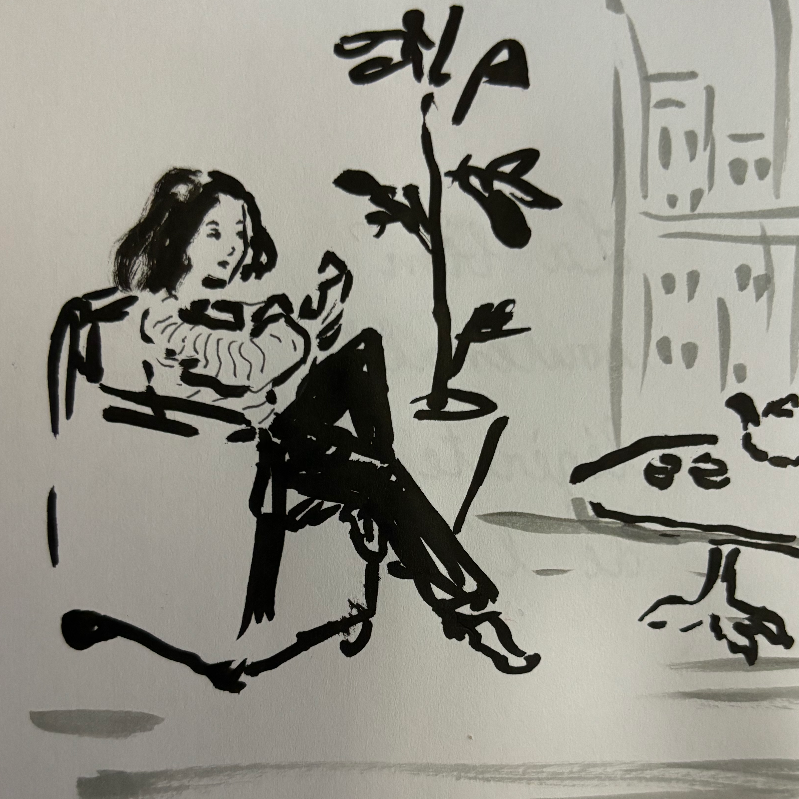

Hi there! I'm a PhD student under the supervision of [Prof Siamak Ravanbakhsh](https://siamak.page/) at **McGill University** and **Mila**. I spent the past year (2023-2024) as a Master's student in Montreal working on *identifiability of abstractions in causal representation learning* and have officially started my PhD as of September 2024.

I completed my MMath degree at the **University of Oxford** (2016 - 2020), where my dissertation was on the topic of profinite groups under the supervision of [Prof Nikolay Nikolov](https://www.maths.ox.ac.uk/people/nikolay.nikolov). I then briefly had a real job as a ML research engineer for a biotech startup in London (2020 - 2022), where we worked on molecular profiling of biomarkers directly from gigapixel whole slide images.

I am always down to procrastinate / drink tea / go climbing / sample chocolate / watch film noir should you find yourself in my vicinity.

I'm also an organizer for the [Causality and Large Models workshop @ Neurips](https://calm-workshop-2024.github.io/) this year, so please come by and say hello.

email: myfirstname.mysurname@mila.quebec